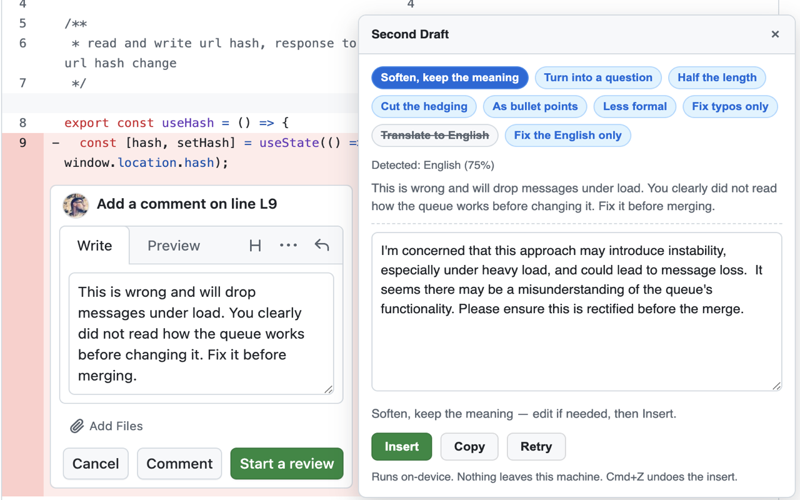

<div align="center">


# Second Draft

**Rewrites what you just typed — using Chrome's built-in on-device model.**<br>
No servers. No API keys. No network requests. It cannot send your text anywhere,
and the manifest is the proof.

[Install](#install) · [Why](#why) · [How it works](#how-it-works) · [Develop](#develop) · [Contribute](CONTRIBUTING.md)

</div>

---

Every other writing assistant in the store sends what you type to somebody's API.
That is fine for a tweet and not fine for a code review comment, an internal
draft, or anything under an NDA. Chrome ships a local model now, so for grammar
and tone — the things people actually need help with most often — the round trip
is unnecessary.

Second Draft never overwrites what you wrote. The rewrite appears next to the
original in an editable box and goes into the field only when you press Insert.

<!-- Replace with a real capture; see PUBLISHING.md for the shot list. -->



## Install

**From the Chrome Web Store** — _link once published._

**From source:**

```bash
git clone https://github.com/viacheslav-ignatov/second-draft
cd second-draft
npm install
npm run build
```

Then open `chrome://extensions`, turn on Developer mode, choose **Load unpacked**
and select the generated `dist/` folder.

Click the toolbar icon first: it reports whether the model is ready and, if not,
downloads it. Then click into any text field, type something, and press
<kbd>Cmd/Ctrl</kbd>+<kbd>Shift</kbd>+<kbd>K</kbd> — or right-click the field and
choose **Second Draft**.

> **Requirements are steep and will exclude some machines:** Chrome 138+ on
> desktop, roughly 22 GB free disk, and a supported GPU. The first run downloads
> a model of several gigabytes. The popup tells you which requirement is missing
> rather than failing silently.

## Why

The interesting part of this project is not the AI. It is that the extension
**declares no host permissions and no content scripts**, so the Chrome Web Store
listing reads _no site access_ — and yet it works on every site.

Both entry points, the context menu item and the keyboard command, grant
`activeTab` for the tab you acted on. The panel is injected at that moment and
nowhere else. The manifest's Content Security Policy sets `connect-src 'none'`,
so Chrome refuses a network request from the service worker or any extension
page even if the code attempted one — which turns "we don't collect your data"
from a promise into a property. The build asserts that directive on every run
and the linter rejects the APIs outright, which is what keeps the injected panel
honest too; see [SECURITY.md](SECURITY.md) for where each guarantee comes from.

| Permission     | Why                                                           |
| -------------- | ------------------------------------------------------------- |
| `contextMenus` | The right-click entry point                                   |
| `activeTab`    | Granted only when you invoke the extension, for that tab only |
| `scripting`    | Injects the panel into that one tab                           |
| `storage`      | Your own presets, synced by Chrome across your profile        |

See [PRIVACY.md](PRIVACY.md) for the full policy.

## What it does

Nine built-in rewrites:

| Preset                       | What it does                                                                      |
| ---------------------------- | --------------------------------------------------------------------------------- |
| **Soften, keep the meaning** | Collaborative instead of blunt, without weakening the claim                       |
| **Turn into a question**     | `this is wrong` → `what happens if…`, the single most useful move in review       |
| **Half the length**          | Compresses without dropping technical detail                                      |
| **Cut the hedging**          | Removes _I think_, _just_, _maybe_, _sorry to bother_ — keeps the claim as strong |
| **As bullet points**         | Restructures prose into a list without inventing or dropping points               |
| **Less formal**              | Relaxed and human instead of stiff, same facts                                    |
| **Fix typos only**           | Spelling and punctuation, in whatever language you are writing                    |
| **Translate to English**     | Offered only when the text is not already English                                 |
| **Fix the English only**     | Grammar and articles, tone untouched                                              |

The last two are why this exists: writing review comments in a second language is
where a local model earns its keep.

Language is detected first, so presets that make no sense are shown struck
through with the reason rather than quietly producing nonsense. Gating requires
the detector to be at least 50% confident — a three-word comment should not lose
you a preset on a coin-flip guess.

Anything house-specific — a company tone of voice, a team's review conventions —
belongs in **your own rewrites** on the options page: a label plus an
instruction, stored in `chrome.storage.sync`, one key per preset.

### Honest limitations

The on-device model is small. It is good at grammar and tone, mediocre at
anything needing judgement, and confidently wrong if you ask it about code. The
hardware bar excludes a lot of laptops. Writer, Rewriter and Proofreader are
still origin-trial APIs in some builds, so those routes fall through to the
Prompt API and the output is a little less faithful.

## How it works

```
src/
├── shared/          the contract, shared by both sides
│   ├── messages.ts      every request and reply that crosses the port
│   ├── rules.ts         pure decision logic — gating, limits, validation
│   ├── tokens.css       the palette, linked by pages and inlined into the panel
│   ├── preset-storage.ts one storage key per preset
│   └── i18n.ts
├── background/      service worker (ES module)
│   ├── presets.ts       the catalogue
│   ├── menus.ts         context menu, rebuilt when presets change
│   ├── inject.ts        on-demand injection via activeTab
│   ├── port.ts          request ids, cancellation, one run at a time
│   └── ai/
│       ├── availability.ts  defensive probing of renamed globals
│       ├── sessions.ts      caching, recovery, streaming, download progress
│       ├── detect.ts        language detection
│       ├── limits.ts        token-aware input size
│       └── executors.ts     Translator → Proofreader → Rewriter → Prompt
├── content/         injected panel (bundled IIFE)
│   ├── target.ts        field capture and insertion
│   ├── panel.ts         shadow-DOM view, no protocol knowledge
│   ├── panel.css
│   ├── client.ts        the panel's end of the port
│   └── index.ts         coordination
├── popup/ options/ welcome/   extension pages, one .ts + .html + .css each
├── generated/       MessageKey union, generated from the English locale
└── static/          manifest, icons, _locales
```

Four decisions worth knowing about before reading the code:

**Insertion uses `document.execCommand("insertText")`.** Deprecated, but the only
path that lands in Chrome's native undo stack, so <kbd>Cmd</kbd>+<kbd>Z</kbd>
brings back what you wrote. Setting `.value` directly — which is what a
React-controlled field needs to notice a change — destroys undo, so it is the
fallback, and when it is used the panel says so.

**The download button is in the popup, not the panel.** A service worker has no
user activation and therefore cannot reliably ask Chrome to fetch the model. A
click in an extension page can.

**Every port message carries an id.** Switching presets mid-stream used to leave
two generations writing into the same box; replies from a superseded run are
dropped, and the worker aborts the previous generation before starting a new one.

**Execution falls through four APIs.** Each route returns `null` when its API is
absent, so the extension degrades gracefully on builds where the newer surfaces
are missing. Input size is measured with `measureInputUsage()` against
`inputQuota` when a session is loaded, falling back to a character count — and
the check runs _before_ a route is chosen, so every route is covered.

## Develop

```bash
npm install
npm run dev        # esbuild watch; reload the extension in chrome://extensions
npm run build      # one-off build into dist/
npm run lint       # eslint + stylelint + prettier --check
npm run format     # fix everything fixable
npm test           # node --test, straight from TypeScript
npm run check      # everything CI runs
npm run package    # check, then zip into release/ for the store
```

No framework, and no bundler config beyond five entry points. TypeScript is
typechecked by `tsc` and transpiled by esbuild; tests run straight from `.ts`
through Node's own type stripping, so there is no test build step. Runtime
dependencies: none.

`npm run check` enforces six things that are easy to break by accident:

- **Types** — `tsc --noEmit` under `strict` with `noUncheckedIndexedAccess`.
- **Lint and format** — ESLint with type-aware rules, stylelint for the
  stylesheets, Prettier for everything.
- **Generated types are current** — `MessageKey` is generated from the English
  locale, so a missing or mistyped message key is a compile error rather than a
  string that renders as itself.
- **Manifest invariants** — no host permissions, no declared content scripts, no
  unjustified permissions. The zero-permission architecture is the product, so it
  is asserted rather than trusted.
- **i18n completeness** — all locales carry the same keys, and placeholders match
  their declarations.
- **Bundle budget** — the extension ships no runtime dependencies and should stay
  small enough to audit; a jump in size fails the build.

### Tests

41 tests, no browser required:

| File                     | Covers                                                           |
| ------------------------ | ---------------------------------------------------------------- |
| `rules.test.ts`          | Language gating, confidence floor, output cleanup, limits        |
| `preset-storage.test.ts` | Per-key storage, corrupt entries, save/delete diffing            |
| `port.test.ts`           | Request ids, cancellation, one generation at a time, error paths |
| `executors.test.ts`      | The route chain degrading correctly when APIs are missing        |
| `target.test.ts`         | Field capture, frame claiming, insertion and the undo fallback   |

`tests/helpers/doubles.ts` holds a fake `chrome.runtime.Port`, a storage stub and
a cancellable fake model; `target.test.ts` runs against happy-dom.

### Adding a language

Copy `src/static/_locales/en/messages.json`, translate the `message` values, and
leave the keys and `placeholders` blocks alone. `npm run check` will tell you if
you missed one.

### Adding a preset

Built-in presets live in `BUILTIN` in `src/background/presets.ts`: a label key
plus an instruction, optionally a Rewriter config and a language restriction. Add
the label to every locale.

Presets specific to one company or team do not belong in the shipped build. They
belong in the options page, on the user's own machine.

## Licence

MIT — see [LICENSE](LICENSE).
